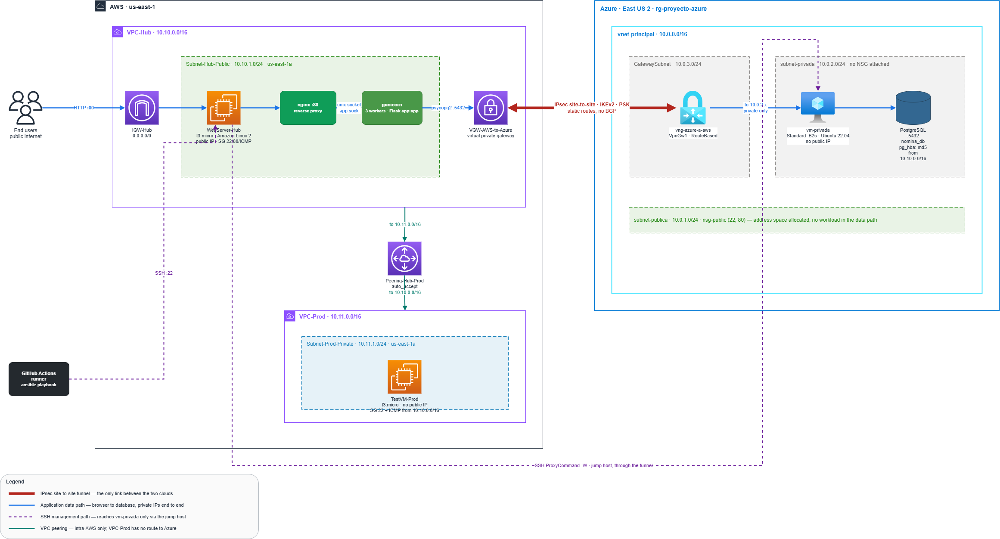
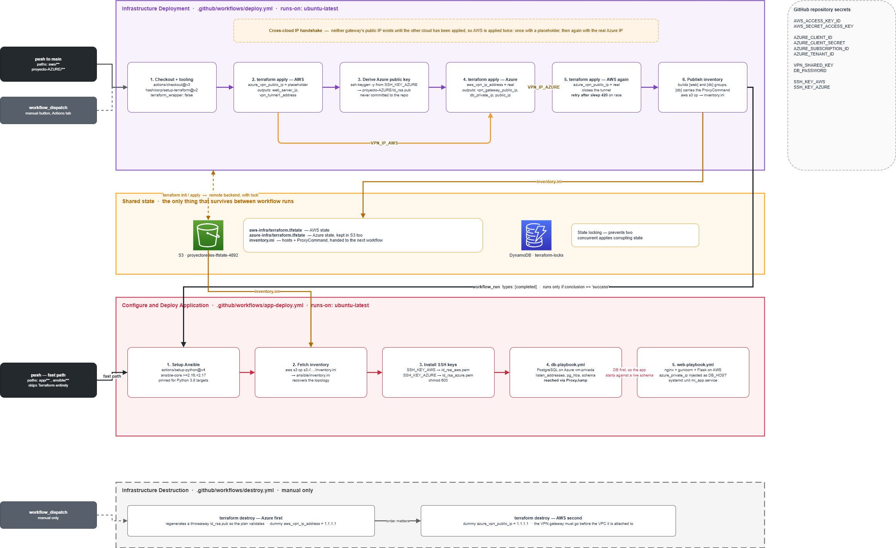

# Multi-Cloud Infrastructure with Terraform and Ansible

## 1. Overview

This project provisions a distributed corporate environment across two public clouds. A Flask frontend runs on AWS; a PostgreSQL database runs on an Azure virtual machine with no public IP address. A site-to-site IPsec (IKEv2) VPN tunnel joins both clouds, so the application reaches the database over private addressing only.

The entire lifecycle is managed as code. Terraform provisions the infrastructure, Ansible configures the hosts, and GitHub Actions orchestrates both.



### Pipeline

1. **Provisioning.** Terraform applies AWS, then Azure, then AWS a second time.
2. **Handshake.** Each cloud requires the public IP of the other's gateway, which does not exist until that cloud has been applied. The pipeline captures the AWS tunnel IP, passes it to Azure, and re-applies AWS with the resulting Azure gateway IP.
3. **State.** Terraform state for both clouds and the generated Ansible inventory are stored in S3, with locking in DynamoDB.
4. **Configuration.** On success, a second workflow runs Ansible against the database first, then the web application.



Both diagrams are generated from editable sources in [`docs/`](docs/) (`architecture.drawio`, `pipeline.drawio`).

---

## 2. Prerequisites

### A. Repository secrets

Configure the following under **Settings → Secrets and variables → Actions**:

| Secret | Purpose |
| --- | --- |
| `AWS_ACCESS_KEY_ID`, `AWS_SECRET_ACCESS_KEY` | IAM user with `AdministratorAccess` |
| `AZURE_CLIENT_ID`, `AZURE_CLIENT_SECRET`, `AZURE_SUBSCRIPTION_ID`, `AZURE_TENANT_ID` | Service principal credentials |
| `VPN_SHARED_KEY` | Pre-shared key for the VPN tunnel |
| `DB_PASSWORD` | Password for the PostgreSQL application user |
| `SSH_KEY_AWS`, `SSH_KEY_AZURE` | Private keys used by Ansible |

### B. Terraform backend

S3 bucket names are globally unique, so the remote backend must point to a bucket you own.

1. Create an S3 bucket and a DynamoDB table named `terraform-locks`.
2. Update the `bucket` value in the `backend "s3"` block of both `aws/main.tf` and `proyecto-AZURE/main.tf`.

```hcl
backend "s3" {
  bucket         = "YOUR-BUCKET-NAME"
  key            = "aws-infra/terraform.tfstate"
  region         = "us-east-1"
  dynamodb_table = "terraform-locks"
  encrypt        = true
}
```

---

## 3. Deployment

No local tooling is required; everything runs in GitHub Actions. The workflows are chained so that application changes do not pay the cost of a full infrastructure run.

| Paths changed | Workflow triggered |
| --- | --- |
| `aws/**`, `proyecto-AZURE/**` (on `main`) | Infrastructure Deployment, then Configure and Deploy Application |
| `app/**`, `ansible/**` | Configure and Deploy Application only |

To deploy, push your changes to a branch, open a pull request against `main`, and merge it. Both workflows also accept a manual `workflow_dispatch` run from the **Actions** tab.

### Destruction

From the **Actions** tab, select **Infrastructure Destruction** and run the workflow. Azure is destroyed before AWS, since the VPN gateway must be removed before the network it is attached to.

---

## 4. Result


- The payroll dashboard is served from the public IP of the AWS EC2 instance.
- The application queries the Azure database exclusively over private addressing (`10.x.x.x`) through the VPN tunnel; that traffic never traverses the public internet in the clear.
- Infrastructure state is persisted and locked in the remote S3 backend.
